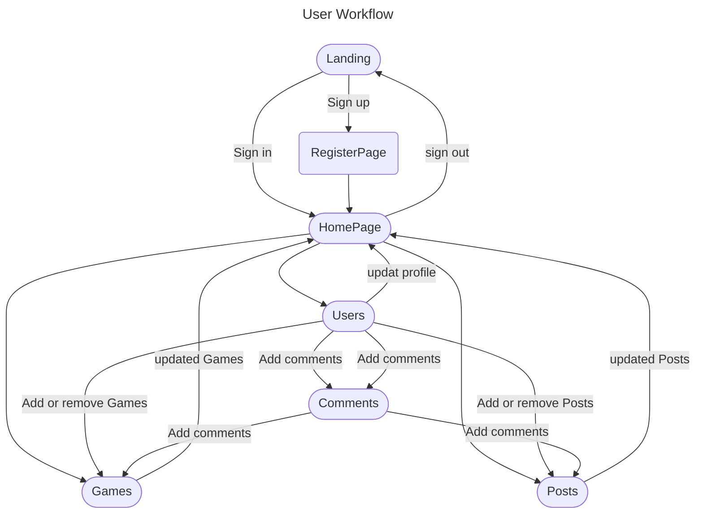

# Workflow Diagrams

## User Workflow
This diagram show that users workflow as they navigate the program.

### Mermaid Diagram

```mermaid
---
title: User Workflow
---
flowchart TD

    A([Landing])-->|Sign up| B(RegisterPage)
    A -->|Sign in| C([HomePage])
    B --> C([HomePage])
    C -->D([Users])
    C -->E([Games])
    C -->F([Posts])
    D --> |updat profile|C
    D --> |Add or remove Games|E
    D --> |Add or remove Posts|F
    E --> |updated Games| C
    F --> |updated Posts| C
    D --> |Add comments|H([Comments])
    H --> |Add comments|F
    D --> |Add comments|H
    H --> |Add comments|E
    C --> |sign out|A


```

